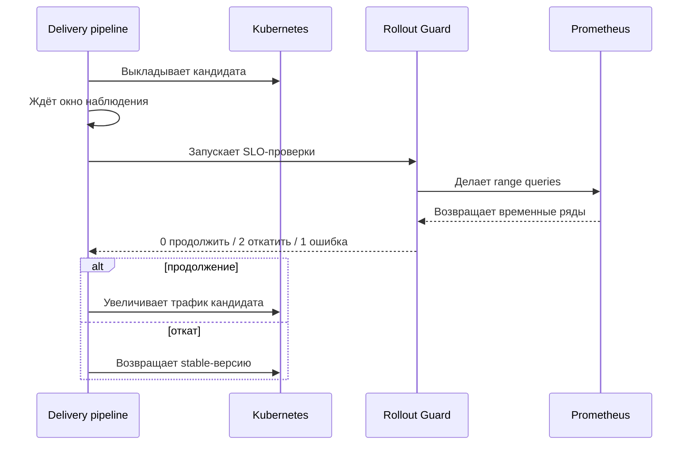

# Архитектура

Rollout Guard запускается на короткое время и не хранит состояние. У него нет
своей базы данных, он не изменяет Kubernetes-объекты и не пытается заменить
delivery-контроллер. За продолжение релиза или откат отвечает вызывающая
система.

## Модель решения

У каждой проверки есть:

- PromQL range query;
- способ свести набор точек к одному числу (`max`, `avg`, `min`, `last`, `sum`);
- оператор сравнения и порог;
- отдельная политика на случай отсутствия данных.

Итог вычисляется консервативно:

1. Любая техническая ошибка или проблема с данными даёт результат `error`.
2. Если ошибок нет, но хотя бы одна проверка не прошла, результат — `rollback`.
3. Только полный набор успешных проверок даёт `promote`.

Разница принципиальна. Недоступный Prometheus не доказывает, что кандидат
здоров, но и не означает, что приложение точно сломано.

## Границы доверия

- TOML-конфигурация считается доверенным входом от delivery-системы.
- Ответ Prometheus проверяется: формат, число рядов, `NaN` и бесконечные числа.
- Bearer-токен читается из переменной окружения и не принимается через TOML.
- ServiceAccount-токен отключён: Job не обращается к Kubernetes API.

## Чего здесь намеренно нет

- переключения трафика;
- управления rollout в Kubernetes;
- долговременного хранения результатов;
- повторного использования состояния Alertmanager;
- универсального языка политик.

За счёт этих ограничений проверку легко повторить для того же временного окна,
протестировать отдельно и подключить к разным системам доставки.
